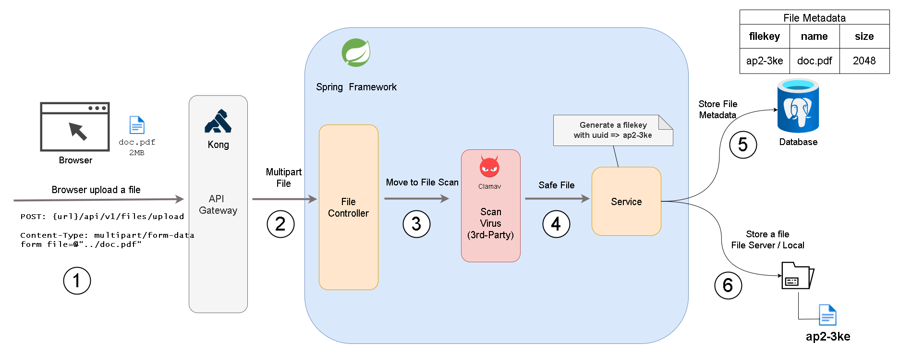

#### 1. Go to the project directory
> $ cd {path}/fileupload

<br>

#### 2. Start DB and scan service
> ..fileupload$ docker-compose up -d postgres scan
 

<br>

#### 3. Run the following command to build the project
> fileupload$ ./mvnw clean && ./mvnw package

<br>

#### 4. Run the following command to start the project
> fileupload$ docker-compose up -d .

<br>

#### 5. Paste the cURL to Postman or use the cURL

```bash

curl --location 'http://localhost:8080/api/v1/file/upload' \
--header 'accept: */*' \
--header 'Content-Type: multipart/form-data' \
--form 'file=@"./src/main/resources/zfilestorage/dump/dump.txt"'

```

<br>

#### Diagrams



<br>

#### Overview

Simple Upload File Architecture and Implementation with Spring Boot <br>

- Spring Boot Rest Controller with Maltilpart to handle data stream from client-side
- `Clamav` is used to scan file virus 
- Generate UUID or filekey to attach with the file metadata (filesize, filename...)
- Store file in the storage with filekey

You can fetch from the storage with the filekey
